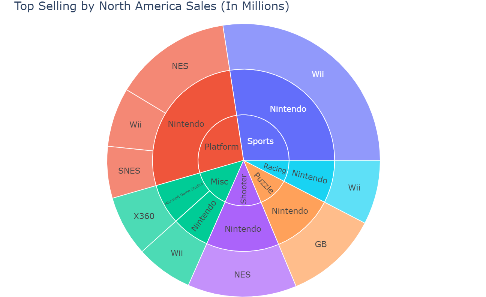

# Video Game Sales Prediction Project

## Problem Statement
For our project, we have decided to take an incisive look at the video game industry, focusing on the task of predicting future sales. Accurate sales forecasting is essential for developers, publishers, and marketers to make informed decisions about game development and marketing strategies. Our goal is to develop a machine learning model that predicts future video game sales based on historical data. We’ll analyze key factors such as genre, platform, region, release timing, along with economic conditions, to create a predictive model that provides valuable insights.

## Datasets Descriptions

The datasets used for analysis are locared in `data` folder. All the datasets are in .csv format.

### GDP Dataset

#### Overview
The GDP dataset provides annual Gross Domestic Product (GDP) data for various countries over multiple years. The data is structured in a wide format, with each row representing a country and each column corresponding to a specific year.

#### Structure
- **Number of Entries**: 266
- **Columns**:
  - `Country Name`: Name of the country.
  - `Country Code`: Unique identifier for each country.
  - `Indicator Name`: Describes the economic indicator (GDP-related in this case).
  - `Indicator Code`: A code representing the indicator.
  - `Years (1960-2023)`: Annual GDP data for each year, represented as floating-point numbers. Some years may have missing data.

#### Source: [World Bank](https://data.worldbank.org/indicator/NY.GDP.MKTP.CD)

#### Usage
This dataset is used to identify the influence of GDP on video game sales. By analyzing GDP trends, we can explore the correlation between economic conditions and consumer spending on video games, which helps in making informed predictions about future sales trends.

### Population Dataset

#### Overview
The Population dataset provides population statistics for various countries over a range of years, similar in structure to the GDP dataset. The data is also in a wide format.

#### Structure
- **Number of Entries**: 306
- **Columns**:
  - `Country Name`: Name of the country.
  - `Country Code`: Unique identifier for each country.
  - `Indicator Name`: Describes the population-related indicator.
  - `Indicator Code`: A code corresponding to the indicator.
  - `Years (1960-2023)`: Annual population data for each year, represented as floating-point numbers. Some years may have missing data.
 
#### Source: [World Bank](https://data.worldbank.org/indicator/SP.POP.1564.TO.ZS) 

#### Usage
This dataset is used to analyze population demographics and their impact on video game sales. Specifically, it focuses on the 15-64 age group, which is considered the primary target audience for video games. By understanding population trends within this demographic, we can assess the potential market size and tailor sales predictions accordingly. This analysis helps in determining the influence of population dynamics on consumer demand for video games.

### Video Game Sales Dataset

#### Overview
The Video Game Sales dataset offers a comprehensive look at sales data for various video games across different platforms and regions. The data is structured in a long format with each row representing a game and its sales figures.

#### Structure
- **Number of Entries**: 16,598
- **Columns**:
  - `Rank`: The rank of the game based on global sales.
  - `Name`: The title of the video game.
  - `Platform`: The gaming platform (e.g., Wii, NES).
  - `Year`: The year of release.
  - `Genre`: The genre of the video game (e.g., Sports, Platform, Racing).
  - `Publisher`: The company that published the game.
  - `NA_Sales`: Sales in North America (in millions).
  - `EU_Sales`: Sales in Europe (in millions).
  - `JP_Sales`: Sales in Japan (in millions).
  - `Other_Sales`: Sales in other regions (in millions).
  - `Global_Sales`: Total worldwide sales (in millions).

#### Source: [Kaggle](https://www.kaggle.com/datasets/gregorut/videogamesales)

#### Usage
This dataset oofers potential for analyzing trends in video game sales across different regions, genres, and platforms over time. 

## Visualization and Data Analysis 

The script for visualization and data analysis is located in `visualization.ipynb` notebook.

#### Installation

To run this project locally, ensure you have the following dependencies installed:

```bash
pip install pandas matplotlib seaborn plotly wordcloud
```

#### Usage

Various interactive visualizations are created to explore and analyze the distribution of sales across platforms, genres, and regions. Techniques such as bar charts, heatmaps, and word clouds are used to visualize the data.

#### Key Visualizations

#### **Top-Selling Games**: A bar chart showing the top 10 best-selling video games globally.


#### **Top-Selling Publishers**: A bar chart showing the top 10 best-selling video games publishers globally.


#### **Sales by Genre**: A comparison of global sales across different game genres.


#### **Platform Popularity**: A line chart displaying sales trends for major gaming platforms over the years.


#### **Word Cloud Ilustration**: A graphic illustration of the most popular words used for video games.


#### **Interactive pie charts**: Interactive pie charts visualize the top-selling video games based on different regional sales.



#### **Interactive histograms**: Visualize genre counts and sales according to platform.


#### **Boxplots**: The script utilizes several boxplots to analyze and visualize the distribution of video game sales across various dimensions, providing key insights into the data. These include boxplots that compare sales across different regions, genres, platforms, and release years.


#### **Regional Sales Distribution**: A heatmap illustrating the distribution of sales across North America, Europe, Japan, and other regions.


#### Statistical Analysis

- **Descriptive Statistics**: Summary statistics such as mean, median, and mode are calculated for various sales columns. For instance, the mean global sales across all games, the median sales for specific platforms, and the standard deviation of sales across different genres are considered.

- **Range of Global Sales**: The global sales of video games have a wide range, from the minimum to a maximum value of 82.73 million units. This indicates significant variability in the success of video games, with a few titles achieving exceptional sales while most games have modest figures.

- **Variance and Standard Deviation of Global Sales**: The variance of 2.45 and standard deviation of 1.57 indicate that while there is variability in sales, most games cluster around the mean, with a few outliers driving the high range.

- **Interquartile Range (IQR) of Global Sales**: The IQR of 0.42 suggests that the middle 50% of games have global sales that are relatively close in value, highlighting that extreme sales figures are outliers.

The key statistical indicators are supported by visualizations and/or tables.

#### Findings

- **Genre Popularity**: The Sports genre dominates global sales, largely driven by titles like Wii Sports. Role-Playing and Platform games also perform strongly, particularly in Japan.

- **Platform Evolution**: The analysis shows the rise and fall of different gaming platforms over time, with platforms like the Wii, NES, and PlayStation series showing significant peaks in their respective eras.

- **Regional Preferences**: The data highlights the variation in gaming preferences across different regions. For example, Japan shows a stronger preference for Role-Playing games, while North America favors Action and Sports games.

- **Range of Global Sales**: The wide range of global sales, with a maximum of 82.73 million units, highlights the stark differences in success among video games. A small number of titles achieve extraordinarily high sales, while most games remain well below this peak.

- **Variance and Standard Deviation**: The variance (2.45) and standard deviation (1.57) further illustrate the spread of sales data, with most games clustering around a central value but with notable outliers that skew the distribution.

## Data Preprocessing 

Python script `data_prep.ipynb` is used to preapre video game sales data (`vgsales.csv`), GDP data (`GDP.csv`), and population data (`Population.csv`) for future modelling. The script loads these datasets, performs data cleaning and transformations, and stores the processed data in an SQLite database for further implementation.

#### Features

 1. Video Game Sales Data
- **Data Loading**: Loads the video game sales data from `vgsales.csv`.
- **Data Inspection**: Provides an overview of the dataset, including data types and missing values.
- **Data Cleaning**: 
  - Fills missing values in the `Year` column with the median.
  - Fills missing values in the `Publisher` column with the mode.
  - Converts the `Year` column to integer type.
- **Data Storage**: Saves the cleaned video game sales data into an SQLite database as a table named `data`.

2. GDP Data
- **Data Loading**: Loads GDP data from `GDP.csv`.
- **Data Cleaning**: 
  - Drops unnecessary columns.
  - Transposes the data to long format.
  - Sums the GDP values across all countries for each year.
- **Data Storage**: Saves the aggregated GDP data into the SQLite database as a table named `gdp`.

3. Population Data
- **Data Loading**: Loads population data from `Population.csv`.
- **Data Cleaning**: 
  - Drops unnecessary columns.
  - Transposes the data to long format.
  - Calculates the mean population across all countries for each year.
- **Data Storage**: Saves the aggregated population data into the SQLite database as a table named `population`.

#### Requirements

To run the script, you need the following Python packages:

- `pandas`
- `sqlite3`

#### How to Use

1. Place the `vgsales.csv`, `GDP.csv`, and `Population.csv` files in the appropriate directory.
2. Run the script to load, clean, and store the data.
3. The cleaned data will be stored in an SQLite database named `games_data.sqlite` with the following tables:
   - `data`: Cleaned video game sales data.
   - `gdp`: Aggregated GDP data.
   - `population`: Aggregated population data.

## Modelling

The `modelling.ipynb` notebook provides an in-depth analysis of video game sales data, utilizing various datasets stored in a SQLite database. The analysis involves data loading, preprocessing, feature engineering, and the application of several machine learning models to predict global video game sales. Despite the effort, the predictive models did not perform as expected, with evaluation metrics such as R² and Mean Squared Error (MSE) indicating room for improvement.

### Features

#### 1. Data Loading
- **Source**: Data is loaded from an SQLite database (`games_data.sqlite`), which includes three primary datasets:
  - **Video Game Sales Data** (`data` table): Contains information about video game sales across different regions.
  - **GDP Data** (`gdp` table): GDP information over various years.
  - **Population Data** (`population` table): Population statistics across different years.
  
#### 2. Data Inspection
- **Initial Inspection**: The script begins by displaying the first few rows of each dataset, allowing for an overview of the data structure, types, and potential anomalies.
- **Descriptive Statistics**: Summary statistics are calculated to understand the central tendency and distribution of the data.

### 3. Data Cleaning
- **Missing Values**: Missing data is identified and handled, either by filling in values or removing rows/columns as appropriate.
- **Data Types**: Data types are checked and converted where necessary to ensure compatibility with subsequent analysis steps.

#### 4. Feature Engineering
- **New Features**: The script creates new features by combining or transforming existing columns to enhance the predictive power of the models. Examples include aggregating sales data or normalizing values based on GDP or population.

#### 5. Model Training and Evaluation
- **Linear Regression**: A simple linear regression model was trained to predict global sales based on various features, including regional sales, year, and GDP.
  - **R² Score**: The model yielded a low R² score, indicating that the model explains very little of the variance in the global sales data.
  - **MSE**: The Mean Squared Error was relatively high, pointing to significant errors in the model’s predictions.

- **Decision Tree Regression**: An attempt to use a decision tree model provided a more flexible approach, but it still underperformed.
  - **R² Score**: Although slightly better than linear regression, the R² score remained unsatisfactory, implying poor predictive accuracy.
  - **MSE**: The decision tree also resulted in a high MSE, reflecting large prediction errors.

- **Neural Network Model**: A deep learning model was implemented using TensorFlow to capture non-linear relationships and improve prediction accuracy.
  - **R² Score**: The TensorFlow model also failed to achieve a satisfactory R² score, suggesting that even complex models struggle to capture the underlying patterns.
  - **MSE**: The high MSE confirmed that the model's predictions were still off by a significant margin.

#### Analysis of Findings

The analysis attempted to build predictive models to estimate global video game sales using a variety of features. However, the results were not successful, as indicated by the evaluation metrics:

- **R² Scores**: Across all models (Linear Regression, Decision Tree Regression, and TensorFlow), the R² scores were low, indicating that the models were not able to adequately explain the variance in the global sales data. This suggests that the chosen features may not be sufficient to predict sales, or that the relationships between these features and global sales are more complex than the models can capture.

- **MSE Values**: The high MSE values across all models further confirmed the poor predictive performance. Large errors in the predictions indicate that the models were not accurate in estimating the global sales figures.

#### Possible Reasons for Poor Model Performance

- **Feature Limitations**: The features used (e.g., regional sales, GDP, year) might not capture the key drivers of global sales, such as marketing strategies, game quality, or consumer behavior.
- **Data Quality**: Issues with data quality, such as missing values or inconsistencies, could have adversely affected the models' ability to learn.
- **Model Complexity**: Even the deep learning model struggled, suggesting that the relationships within the data might require different modeling approaches, additional data collection or more sophisticated feature engineering.

#### Prerequisites

  - `pandas`: For data manipulation and analysis.
  - `numpy`: For numerical operations.
  - `sqlite3`: For database interactions.
  - `sklearn`: For machine learning models.
  - `tensorflow`: For deep learning models.
  - `matplotlib`: For visualizations.

#### Usage

1. **Prepare the Environment**: Ensure that the required libraries are installed, and the SQLite database is correctly placed in the specified path.

2. **Run the Script**: Execute the script cell by cell if using a Jupyter notebook, or run it as a standalone Python script.

3. **Analyze the Results**: Review the output, particularly the R² and MSE values, to understand the limitations of the models.

#### Conclusion

This script provides a comprehensive analysis of video game sales data, but the predictive models developed were not successful. The findings suggest that further work is needed to improve model performance, potentially through the inclusion of additional features, better data cleaning, or the use of alternative modeling techniques.
